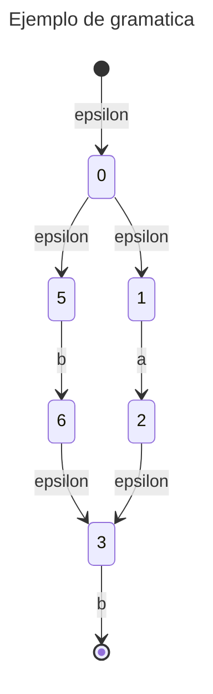

![[UAG.png]]

# MAREMI
## El compilador de ensueños

Mario Alberto Avelar Gutierrez
mario.avelar@edu.uag.mx
Jesus Emiliano Reyes Gomez
jesuse.reyes@edu.uag.mx

Av. Patria 1201 Col. Jardines del Valle
CP. 45129
Zapopan, Jalisco.
a 2 de Febrero del 2023


## Contenido


## Introduccion

## Análisis

>"Recuerda: si lo puedes construir, lo puedes programar." - MAREMI

Después de analizar el mundo de los compiladores, IDE y herramientas de programación disponibles para principiantes, se ha identificado una falta de entornos gráficos atractivos y que se adapten a las tendencias actuales de los niños y jóvenes. A pesar de que muchos ofrecen una gran capacidad para escalar el código inicial, no todos lo hacen de manera intuitiva. Aquellos que no lo hacen de manera intuitiva, a menudo utilizan una forma tediosa que puede frustrar al usuario.

La forma más sencilla de acceder a una herramienta de programación es a través de la web. Se ha encontrado que existen muchas herramientas que ofrecen un IDE de escritorio pero que no ofrecen una solución web.

Por lo tanto, se ha creado un compilador de ensueño: una solución web con una interfaz gráfica atractiva que se adapta a las tendencias del siglo XXI, basada en el popular videojuego "Minecraft". Esta solución proporciona una interfaz de entrada de texto con salidas tanto gráficas como de texto, lo que permite al usuario adentrarse en un ambiente más real en el mundo de la programación.

Además, contará con herramientas de apoyo para orientar al usuario basado en un paradigma de programación orientada a objetos, con una sintaxis sencilla en español. Por ejemplo, la sintaxis utilizada en esta solución será:

``` rdc
materiales <vacio>

material MiMadera <madera>  8

material MiPiedra <piedra> 3

material MiCemento <cemento> 10

materiales.agregar <MiMadera>

materiales.agregar <MiPiedra>

materiales.agregar <MiCemento>

casa MiCasa <materiales>

mientras MiCasa.contruir <mansion> -> mensaje <'En construccion'>

si MiCasa.contruida -> mensaje <'Felicidades por tu casa'>

si MiCasa.insuficiente -> mensaje <'Materiales insuficientes'>
```

## Diseño

El diseño del compilador empleado en este proyecto utiliza autómatas para ejemplificar gramáticas y mejorar la eficiencia del proceso de análisis sintáctico. Además de esto, emplea la eliminación de la recursividad y la factorización de lexemas no terminales como manejadores de errores para mejorar la capacidad de detección y corrección de errores en el código fuente.

La implementación de expresiones regulares también se utiliza en este compilador para mejorar la capacidad de análisis léxico. Al utilizar estas expresiones, el compilador es capaz de identificar y clasificar patrones específicos en el código fuente de manera más eficiente.

En cuanto a la estructura general del compilador, se compone de varias fases que se encargan de la detección y corrección de errores, el análisis léxico, el análisis sintáctico, la generación de código intermedio y la optimización de código. Cada fase utiliza diferentes técnicas y herramientas para procesar el código fuente y prepararlo para su compilación y ejecución.

En general, el diseño de este compilador se enfoca en mejorar la eficiencia del proceso de compilación, la capacidad de detección y corrección de errores, y la capacidad de análisis léxico y sintáctico del código fuente.

### Autómata finito no determinista

El diseño de los autómatas de la gramática puede ser ejemplificado mediante un diagrama de estados. A continuación se ejemplifica la siguiente gramática:

```rdc
(a | b) b
```
El diagrama de estados correspondiente es el siguiente:



### Gramática

La gramática a la fecha de redacción de este documento es la siguiente:

```
	P -> A | E | F
	A -> RSV id < t > d
	E -> RSV id . F - > M
	M -> RSV < msj >
	F -> RSV < id > | RSV < t > | RSV
	RSV -> MT | HW | V
	MT -> madera | piedra | cemento | ladrillo
	HW -> si | mientras | agregar | construir | insufuciente
	V -> material | materiales | casa
```

### Manejo de errores

Para el manejo de errores de esta gramática se emplean técnicas de:

1.  Eliminación de recursividad
2.  Factorización de no terminales

## Codificación

Para el manejo visual del proyecto, se utiliza JavaScript, y más específicamente la librería React.js. React.js es una librería de código abierto que se enfoca en la creación de interfaces de usuario (UI) de una manera eficiente y escalable. Al utilizar React.js en el front-end, el proyecto obtiene las siguientes ventajas:

-   React.js utiliza un enfoque basado en componentes, lo que facilita la creación y reutilización de código.
-   React.js es altamente escalable y puede manejar grandes aplicaciones sin comprometer la velocidad y la eficiencia.
-   React.js utiliza una metodología de actualización incremental, lo que permite actualizar solo los componentes que han cambiado en lugar de actualizar toda la interfaz de usuario.

Para la compilación del código generado, se emplea un backend en Python. Python es un lenguaje de programación de alto nivel que se utiliza en una variedad de aplicaciones, incluyendo el desarrollo web. Al utilizar Python en el backend, el proyecto obtiene las siguientes ventajas:

-   Python es un lenguaje fácil de aprender y usar, lo que permite una rápida implementación y prototipado.
-   Python es un lenguaje versátil y se puede utilizar en una variedad de aplicaciones, desde el desarrollo web hasta la inteligencia artificial y el análisis de datos.
-   Python cuenta con una gran cantidad de librerías y frameworks que facilitan el desarrollo y la implementación de aplicaciones